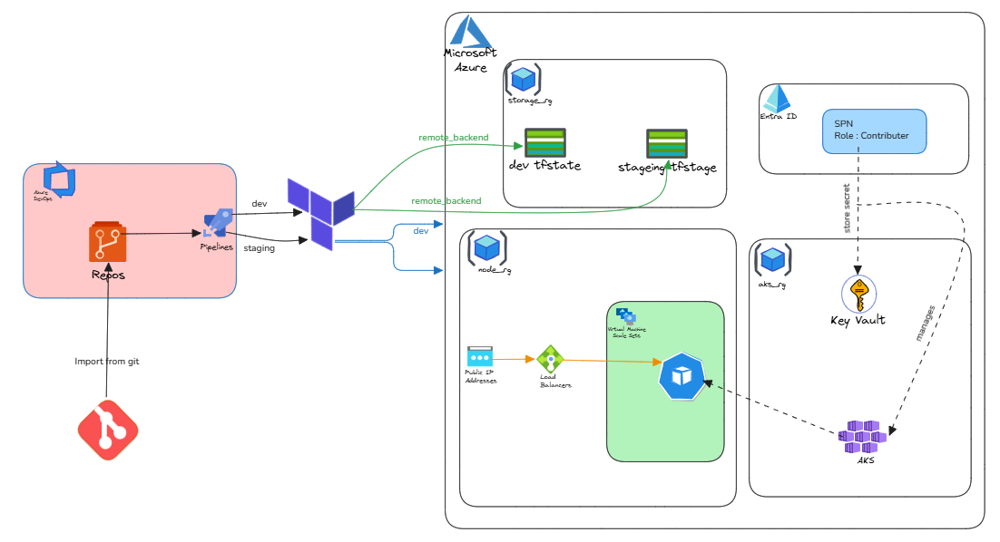

# Azure Infrastructure Automation with Terraform & Azure DevOps

This repository demonstrates a complete **Infrastructure as Code (IaC)** pipeline for deploying a scalable, secure, and multi-environment architecture on **Microsoft Azure**. 

The project showcases the automation of an **Azure Kubernetes Service (AKS)** cluster, integrated with high-availability networking and centralized security management.

---

## 🏗️ Architecture Diagram

*Visual representation of the CI/CD flow from Git to Azure Cloud.*

---

## 🛠️ Tech Stack & Tools

* **Cloud Provider:** Microsoft Azure
* **Infrastructure as Code:** Terraform (HCL)
* **CI/CD Orchestration:** Azure DevOps (Pipelines & Repos)
* **Container Orchestration:** Azure Kubernetes Service (AKS)
* **Identity & Security:** Azure Entra ID (Service Principals) & Azure Key Vault
* **Version Control:** Git

---

## 🔍 Key Architectural Components

### 1. CI/CD Pipeline (Azure DevOps)
- **Source Control:** Code is managed in **Azure Repos** (imported via Git).
- **Multi-Stage Deployment:** The pipeline supports independent workflows for `dev` and `staging` environments.
- **Terraform Integration:** Automated `plan` and `apply` cycles triggered by code commits.

### 2. State Management & Security
- **Remote Backend:** Terraform state files are stored securely in **Azure Blob Storage** (`storage_rg`). 
    - Separate containers for `dev_tfstate` and `staging_tfstate` to ensure environment isolation.
- **Identity (Entra ID):** Uses a **Service Principal (SPN)** with "Contributor" roles for automated deployment.
- **Secret Management:** Sensitive credentials are stored in **Azure Key Vault**, which the AKS cluster and Service Principal use to manage infrastructure securely.

### 3. Target Infrastructure (Azure)
- **AKS Cluster:** A managed Kubernetes environment located in the `aks_rg` resource group.
- **Scalability:** Utilizes **Virtual Machine Scale Sets (VMSS)** to handle variable workloads.
- **Networking:** Includes **Public IP Addresses** and **Azure Load Balancers** to manage ingress traffic to the node pool.

---

## 🚀 Deployment Workflow

1.  **Code Push:** Developer pushes Terraform configuration to the repository.
2.  **Validation:** Azure Pipelines triggers a linting and validation check.
3.  **Plan:** Terraform generates an execution plan against the `dev` or `staging` remote state.
4.  **Manual Approval (Optional):** Gatekeeping for staging/production deployments.
5.  **Provision:** Terraform applies changes, provisioning AKS, Networking, and Security components.
6.  **Verification:** AKS cluster becomes operational and fetches necessary secrets from Key Vault.

---
