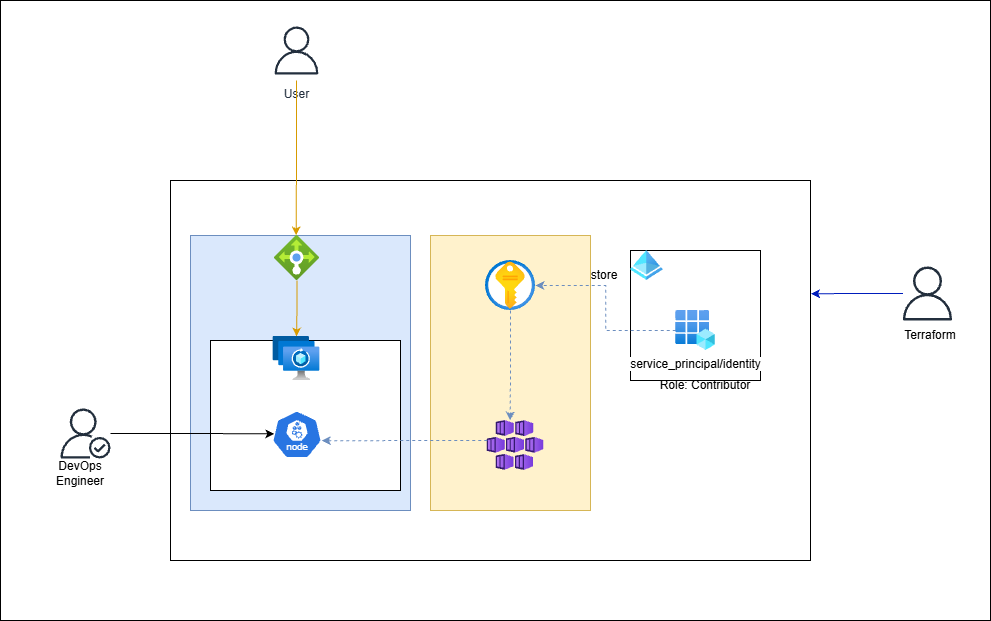

# 🚀 Azure DevOps Project 1: Infrastructure Automation & CI/CD 

## 📌 Project Overview
This project serves as a comprehensive demonstration of a modern **DevOps Lifecycle** on Microsoft Azure. It bridges the gap between manual resource creation and fully automated, secure, and scalable cloud deployments.

The goal of this lab was to architect a secure environment using **Infrastructure as Code (IaC)** and automate application delivery through **Azure Pipelines**.

---

## 🛠️ Technical Ecosystem
| Category | Tools & Services |
| :--- | :--- |
| **Cloud Provider** | Microsoft Azure |
| **IaC** | Terraform / Bicep |
| **Orchestration** | Azure Kubernetes Service (AKS) |
| **CI/CD** | Azure DevOps Pipelines (YAML) |
| **Security** | Azure Key Vault, RBAC, 

---

## 🏗️ Key Implementation Details

### 1. Infrastructure as Code (Terraform)
* Implemented a modular Terraform structure for reusability.
* Configured **Remote Backend** storage in Azure Blob Storage with State Locking.
* Automated provisioning of Virtual Networks, Subnets, and Network Security Groups (NSG).

### 2. Secure Secret Management
* Integrated **Azure Key Vault** to eliminate hardcoded credentials.
* Utilized **Azure RBAC** (Role-Based Access Control) to grant "Least Privilege" access to service principals.
* Configured Secret injection during the CI/CD pipeline execution.

### 3. CI/CD Pipeline Architecture
* **Continuous Integration:** Automated linting, validation, and security scanning of Terraform files.
* **Continuous Deployment:** Multi-stage deployment strategy (Dev -> Staging -> Prod) with manual approval gates.
* **Container Strategy:** Automated builds pushed to **Azure Container Registry (ACR)** and deployed to **AKS**.
