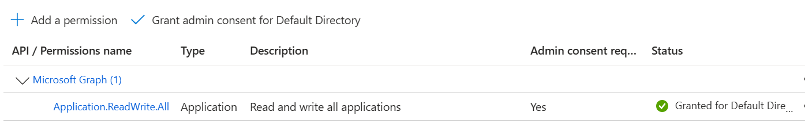
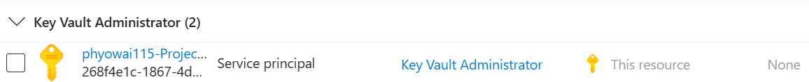

# Azure Infrastructure Automation with Terraform & Azure DevOps

This repository demonstrates a complete **Infrastructure as Code (IaC)** pipeline for deploying a scalable, secure, and multi-environment architecture on **Microsoft Azure**. 

The project showcases the automation of an **Azure Kubernetes Service (AKS)** cluster, integrated with high-availability networking and centralized security management.

---

## 🏗️ Architecture Diagram


---

## 🛠️ Tech Stack & Tools

* **Cloud Provider:** Microsoft Azure
* **Infrastructure as Code:** Terraform (HCL)
* **CI/CD Orchestration:** Azure DevOps (Pipelines & Repos)
* **Container Orchestration:** Azure Kubernetes Service (AKS)
* **Identity & Security:** Azure Entra ID (Service Principals) & Azure Key Vault
* **Version Control:** Git

---

## 🔍 Key Architectural Components

### 1. CI/CD Pipeline (Azure DevOps)
- **Source Control:** Code is managed in **Azure Repos** (imported via Git).
- **Multi-Stage Deployment:** The pipeline supports independent workflows for `dev` and `staging` environments.
- **Terraform Integration:** Automated `plan` and `apply` cycles triggered by code commits.
```yaml
//create pipeline

trigger: none

parameters:
  - name: environment
    type: string
    values:
      - dev
      - staging
    default: dev


stages:

- stage: Build
  jobs:
    - job: Build
      pool: MyPool
      steps:
      - script: sudo apt-get update && sudo apt-get install -y unzip
        displayName: 'install unzip on agent'
      - task: TerraformInstaller@1
        displayName: TF_installation
        inputs:
          terraformVersion: 'latest'
      
      - task: TerraformTask@5
        displayName: tf init
        inputs:
          provider: 'azurerm'
          command: 'init'
          workingDirectory: '$(System.DefaultWorkingDirectory)/Project_1/${{ parameters.environment }}'
          backendAzureRmUseCliFlagsForAuthentication: true
          backendServiceArm: 'Azure_Connection'
          backendAzureRmResourceGroupName: 'terraform-state-rg'
          backendAzureRmStorageAccountName: 'tfbackendfor${{ parameters.environment }}'
          backendAzureRmContainerName: 'tfstate'
          backendAzureRmKey: '${{ parameters.environment }}.terraform.tfstate'

      - task: TerraformTask@5
        inputs:
          provider: 'azurerm'
          command: 'validate'
          workingDirectory: '$(System.DefaultWorkingDirectory)/Project_1/${{ parameters.environment }}'
      - task: TerraformTask@5
        inputs:
          provider: 'azurerm'
          command: 'plan'
          workingDirectory: '$(System.DefaultWorkingDirectory)/Project_1/${{ parameters.environment }}'
          environmentServiceNameAzureRM: 'Azure_Connection'

      - task: TerraformTask@5
        inputs:
          provider: 'azurerm'
          command: 'apply'
          workingDirectory: '$(System.DefaultWorkingDirectory)/Project_1/${{ parameters.environment }}'
          commandOptions: '--auto-approve'
          environmentServiceNameAzureRM: 'Azure_Connection'

```

```yaml
//destroy pipeline

trigger: none

parameters:
  - name: environment
    type: string
    values:
      - dev
      - staging
    default: dev

stages:
  - stage: Destroy
    jobs:
      - job: Destroy
        pool: MyPool
        steps:
        - task: TerraformInstaller@1
          inputs:
            terraformVersion: 'latest'
        - task: TerraformTask@5
          inputs:
            provider: 'azurerm'
            command: 'init'
            workingDirectory: '$(System.DefaultWorkingDirectory)/Project_1/${{ parameters.environment }}'
            backendAzureRmUseCliFlagsForAuthentication: true
            backendServiceArm: 'Azure_Connection'
            backendAzureRmResourceGroupName: 'terraform-state-rg'
            backendAzureRmStorageAccountName: 'tfbackendfor${{ parameters.environment }}'
            backendAzureRmContainerName: 'tfstate'
            backendAzureRmKey: '${{ parameters.environment }}.terraform.tfstate'
        - task: TerraformTask@5
          inputs:
            provider: 'azurerm'
            command: 'destroy'
            workingDirectory: '$(System.DefaultWorkingDirectory)/Project_1/${{ parameters.environment }}'
            commandOptions: '--auto-approve'
            environmentServiceNameAzureRM: 'Azure_Connection'

```

### 2. State Management & Security
- **Remote Backend:** Terraform state files are stored securely in **Azure Blob Storage** (`storage_rg`). 
    - Separate containers for `dev_tfstate` and `staging_tfstate` to ensure environment isolation.
- **Identity (Entra ID):** Uses a **Service Principal (SPN)** with "Contributor" roles for automated deployment.
- **Secret Management:** Sensitive credentials are stored in **Azure Key Vault**, which the AKS cluster and Service Principal use to manage infrastructure securely.

### 3. Target Infrastructure (Azure)
- **AKS Cluster:** A managed Kubernetes environment located in the `aks_rg` resource group.
- **Scalability:** Utilizes **Virtual Machine Scale Sets (VMSS)** to handle variable workloads.
- **Networking:** Includes **Public IP Addresses** and **Azure Load Balancers** to manage ingress traffic to the node pool.

---

## 🚀 Deployment Workflow

1.  **Code Push:** Developer pushes Terraform configuration to the repository.
2.  **Validation:** Azure Pipelines triggers a linting and validation check.
3.  **Plan:** Terraform generates an execution plan against the `dev` or `staging` remote state.
4.  **Manual Approval (Optional):** Gatekeeping for staging/production deployments.
5.  **Provision:** Terraform applies changes, provisioning AKS, Networking, and Security components.
6.  **Verification:** AKS cluster becomes operational and fetches necessary secrets from Key Vault.

---
## :monocle_face: Troubleshooting

### Integrate to Azure DevOps

need to ```Grant admin for API permission```



### Storage blob Authorization issue 

```bash

╷
│ Error: Failed to get existing workspaces: listing blobs: executing request: unexpected status 403 (403 This request is not authorized to perform this operation.) with AuthorizationFailure: This request is not authorized to perform this operation.
│ RequestId:c7b54bb5-001e-003e-188f-a8467c000000
│ Time:2026-02-28T08:50:50.9981270Z
│ 
│ 
╵
```

Need to assign ```storage blob contributer``` role for your identity


### Key Vault Authorization issue (unable to create key_vault_secret)

```bash
╷
│ Error: unexpected status 403 (403 Forbidden) with error: AuthorizationFailed: The client '***' with object id 'b8d8e78a-f0ee-402d-ba75-aaaaaaaaaaa' does not have authorization to perform action 'Microsoft.Authorization/roleAssignments/write' over scope '/subscriptions/<subscription_id>/providers/Microsoft.Authorization/roleAssignments/7a32af1e-76d6-4095-7894-4accc162f20c' or the scope is invalid. If access was recently granted, please refresh your credentials.
│ 
│   with azurerm_role_assignment.sp_role,
│   on main.tf line 10, in resource "azurerm_role_assignment" "sp_role":
│   10: resource "azurerm_role_assignment" "sp_role" {
│ 
╵
╷
│ Error: a resource with the ID "https://aks-dev-kv115.vault.azure.net/secrets/72d367f4-c6d0-4647-bfae-62629aff130a/d7161768e0e54390bda94019bb207443" already exists - to be managed via Terraform this resource needs to be imported into the State. Please see the resource documentation for "azurerm_key_vault_secret" for more information
│ 
│   with azurerm_key_vault_secret.kv_secret,
│   on main.tf line 22, in resource "azurerm_key_vault_secret" "kv_secret":
│   22: resource "azurerm_key_vault_secret" "kv_secret" {
│ 
╵
```
Need to assign ```key vault contributer``` role for your identity


